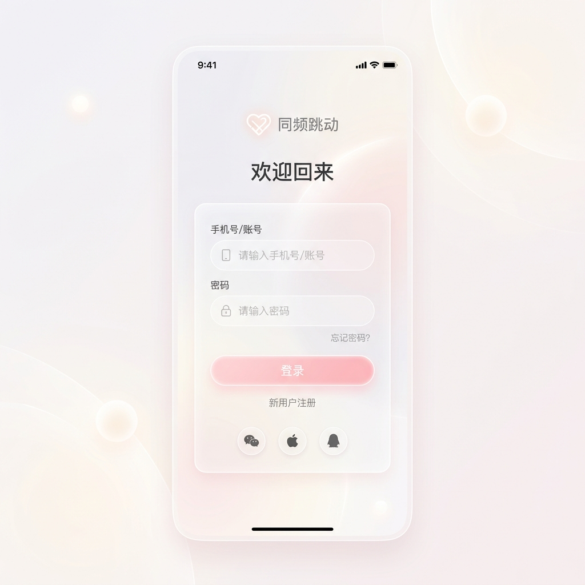

# 同频跳动 - 登录页高级感重构方案

> [!TIP]
> 这是一个纯设计维度的升级方案，旨在用现代“情绪胶囊风”替代现有的基础样式，打造让人一眼心动的高级感。当前仅做方案展示，不修改业务代码。

## 设计理念：情绪胶囊风 💊

为了契合“只属于两个人的安静空间”这一定位，我们抛弃了常规直白的表单形态，引入了极具呼吸感和情绪价值的现代设计语言：

- **色彩体系**：彻底摒弃死板的纯白与硬朗的深色边框。使用**奶油白与浅粉白交织的流体渐变**作为底色，主操作区采用**柔和蔷薇粉**，并在视觉边缘点缀雾紫与浅蓝灰的光晕（Halo effect）。
- **材质表现**：大面积运用**毛玻璃（Glassmorphism）**效果。表单面板不再是一个生硬的白块，而是像悬浮在粉色浪漫氛围中的透光磨砂玻璃卡片。
- **形态特征**：贯彻“胶囊”品牌符号，输入框、按钮乃至错误提示，全部采用**极度圆润的 Pill-shape（全圆角）**设计。

## 效果预览

下面是为新版 App 登录页设计的全屏视觉概念图（Native App Mockup），带入了手机端特有的沉浸式全屏体验结构。**保留了高级的弥散光影和毛玻璃质感，但将所有色彩饱和度降到极低（Pale & Faint），做到既有沉浸氛围又不会显得花哨杂乱**：

## 核心优化方向

### 1. 淡雅的沉浸式呼吸背景 (Pale Immersive Background)
- **现状**：现有的 `visualStage` 和 `authHero` 虽然有遮罩，但在整体屏幕上显得层次单薄。
- **升级**：保留了动态的网格渐变（Mesh Gradient）和弥散光影，但**极大降低了色彩浓度与不透明度**。背景底色为极浅的奶油白，光晕部分则是近乎透明的浅粉与雾白交织。既拥有玻璃卡片悬浮的浪漫氛围感，又保证了整体视觉的绝对清爽，久看不厌。

### 2. 悬浮感表单面板 (Floating Form Card)
- **现状**：`authPanel` 的边框和投影显得厚重（`rgba(255,255,255,0.72)` + 纯色边框 + 硬阴影）。
- **升级**：
  - 增强毛玻璃的质感：背景改为 `rgba(255, 255, 255, 0.4)` 并辅以更强的 `backdrop-filter: blur(24px)`。
  - 去除硬边框，改用极细的半透明白色内发光边缘（Inner shadow/border），模拟真实的玻璃高光。
  - 将沉重的阴影替换为**大半径的彩色弥散阴影**（如偏粉紫色的柔和投影），让面板有轻盈悬浮的感觉。

### 3. 胶囊化输入与反馈 (Capsule Interactions)
- **现状**：输入框可能较为传统，Focus 时的变化不够细腻。
- **升级**：
  - **输入框（AppTextInput）**：完全变更为圆润的胶囊形。未激活时呈现淡淡的半透明磨砂质感；获取焦点时，周围泛起蔷薇粉色的微光晕（Glow effect）。
  - **按钮（PrimaryButton）**：采用平滑的粉色到奶油粉的渐变，按下时配合 `expo-haptics` 触感反馈以及局部的回弹动效（Spring animation）。
  - **复选框**：将现有的方形/带微小圆角的 checkbox，改为更圆润甚至纯圆形的微小胶囊态。

### 4. 品牌与文案展示 (Brand Typography)
- **字体排印**：标题（如“把每天，轻轻存下”）改用更具人文气息、字重分布更合理的现代字体。适当增加字间距（Tracking），降低 `opacity` 打造轻盈的呼吸感，而非一味使用纯黑 `colors.ink`。
- **微动效**：进入登录页时，品牌 Logo 与 Slogan 可采用柔和的“向上浮现 + 淡入”（Fade & Slide up）进场动画，建立高级的第一印象。
