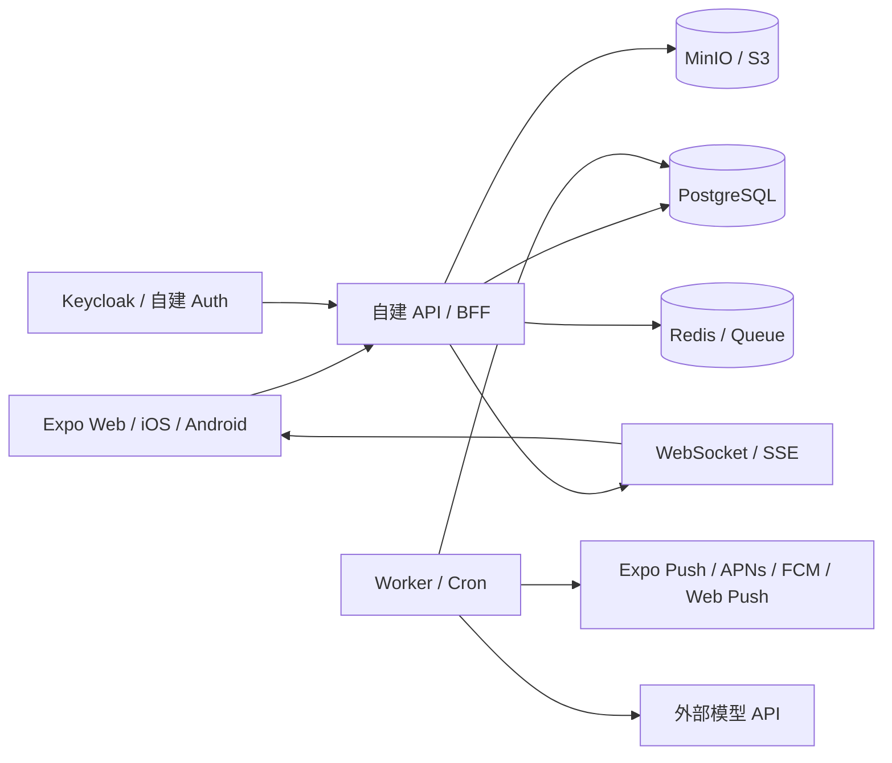

# 自建服务器迁移方案

## 结论

当前 App 运行时代码已经迁到自建 API / Postgres / MinIO / Redis / Push worker 路线，严格检查 `npm run check:supabase-usage:strict` 必须保持通过。`packages/db/migrations`、`packages/db/policies` 和 `supabase/functions` 仍作为历史 Supabase 结构和旧数据迁移来源参考保留。

如果要“完全脱离 Supabase”，就不能只改数据库地址，必须同时替换并验证：

- Auth / Session
- Postgres schema / RPC / 权限
- Storage
- Realtime
- Edge Functions
- Cron / Queue / Push worker

优化后的执行路线见 `docs/self-host-optimized-roadmap.md`。当前 staging 基建和自建 API / BFF 兼容层已经落地；剩余生产门禁集中在旧 Supabase 用户数据迁移、Storage 复制、final verify、迁移后 smoke 和切流观察。旧数据没有完成对账前，不能关闭 Supabase、删除旧数据或让真实用户切到 self-host 作为唯一权威源。

## 目标架构



建议单机起步的最小组合：

- 反向代理：Caddy 或 Nginx
- API 服务：Node.js 20+，Fastify 或 NestJS
- Worker：同一套代码单独进程
- 数据库：PostgreSQL
- 队列：Redis
- 对象存储：MinIO
- 认证：默认先做 API 内置轻量 Auth；Keycloak 作为后续可选增强

## 空服务器落地策略

你的服务器是新买的空服务器，最佳路线不是一次性把 Supabase 生产流量切过去，而是先搭一套“旁路自建后端”，让它在不影响现网的情况下跑通完整链路。

### 当前服务器已确认状态

已通过你当前 Safari 页面中的腾讯云控制台和 OrcaTerm 确认：

- 云厂商：腾讯云轻量应用服务器 / OrcaTerm 控制台
- 实例页面：`Ubuntu-2fho`
- 实例 ID：`lhins-jrgoqirx`
- 地域：`ap-guangzhou`，广州三区
- 公网 IPv4：`81.71.9.118`
- 内网 IPv4：`10.1.0.10`
- 登录用户：`ubuntu`
- 系统：Ubuntu 22.04.5 LTS (Jammy Jellyfish)
- 内核：Linux 5.15.0-179-generic x86_64
- CPU：4 vCPU
- 内存：4 GB 套餐，系统内可用约 3.6 GiB，无 swap
- 系统盘：SSD 云硬盘 40 GB，根分区已用约 4.4 GB，剩余约 34 GB
- 带宽与流量：3 Mbps，300 GB/月
- 到期时间：2027-06-11 20:15:44
- Docker / Docker Compose：已安装，Docker `29.1.3`，Compose `2.40.3`
- 宿主机 `ufw`：inactive
- 腾讯云轻量防火墙：允许 `22/tcp`、`80/tcp`、`443/tcp`、ICMP，来源均为全部 IPv4 地址
- 当前监听端口：`22/tcp` SSH、`53/udp`、`68/udp`、`123/udp` 等系统服务，未发现 Web / PostgreSQL / Redis / MinIO 服务
- `/opt/tongpin` 已创建并上传 staging 模板，远端 `docker compose --env-file .env -f compose.yml config` 已通过；`.env` 只保存在服务器本地，权限为 `600`
- 腾讯云 Docker registry mirror 已配置，Docker 已重启并生效；原 Docker 配置已备份到 `/etc/docker/daemon.json.codex-backup-20260611222242`
- `/opt/tongpin` staging 栈已启动：Caddy、API、Worker、PostgreSQL、Redis、MinIO
- 本机健康检查已通过：`http://127.0.0.1:3000/health` 返回 `status: ok`，PostgreSQL `pg_isready` accepting connections，Redis 返回 `PONG`
- 公网 `80/tcp` 已到 Caddy；直接访问 IP 会返回 Caddy 的 HTTPS `308` 重定向
- DNSPod 已添加 A 记录：`tongpin.fancah.tech`、`api-staging.fancah.tech` 和 `assets-staging.fancah.tech` 均指向 `81.71.9.118`
- `fancah.tech` 已完成 ICP 备案；Caddy 已为上述三个域名获取 Let's Encrypt 证书，公网 HTTPS 已可直接访问
- 临时 `codex-tongpin-staging` SSH 公钥标记已清理，上传临时包已清理

仍需继续确认：

- 是否启用快照或其他外部备份
- 是否接受在后续绑定 SSH key 后收紧 `22/tcp` 来源

在备份、HTTPS 端口和 SSH 来源策略确认前，不做生产切换，也不写入真实生产 secrets。

优化后的推荐执行顺序：

1. 稳定 staging 基建：Docker Compose、健康检查、备份、重启自恢复、SSH 收口。
2. 解决 staging 公网入口：优先 Cloudflare Tunnel；如需腾讯云公网直连，再处理 ICP 备案。
3. 建立自建 API / BFF 边界：前端不再直接新增 Supabase 表查询，后端从 session 解析用户身份。
4. 先接测试账号：跑通 Auth、dashboard、留言、Storage 这几条最小链路。
5. 逐个替换 Supabase RPC、Storage、Realtime、Edge Functions 和 Push worker。
6. 做数据迁移演练和回滚演练。
7. 单独确认后才切生产域名和生产环境变量。

服务器上不要直接裸跑 Node 进程。所有服务用 Docker Compose 管理，便于重启、备份、迁移和回滚。

### 建议服务器目录

```text
/opt/tongpin/
  compose.yml
  .env
  caddy/
    Caddyfile
  api/
  backups/
    postgres/
    minio/
  scripts/
    backup-postgres.sh
    backup-minio.sh
    healthcheck.sh
```

### 最小 Docker Compose 服务

- `caddy`：HTTPS、反向代理、静态资源代理
- `api`：业务 API
- `worker`：推送、云宠 AI、定时任务
- `postgres`：业务数据库
- `redis`：队列、presence、限流
- `minio`：头像、相册、缩略图对象存储
- `postgres-backup`：定时备份，或先用宿主机 cron

Keycloak 暂不作为第一阶段默认服务。原因是它会增加 Java 服务、realm/client 配置、邮件模板和资源占用。当前项目只需要邮箱密码、重置密码、session、账号冻结/删除请求，第一阶段用 API 内置 Auth 更直接：

- `users` 表
- `user_sessions` 表
- Argon2id 密码哈希
- refresh token 轮换
- 邮箱重置 token
- 账号冻结 / 注销申请状态

如果后续要多应用 SSO、第三方登录、企业后台账号，再引入 Keycloak。

### 我通过 Safari 代操作的边界

可以由我通过你当前 Safari 页面操作云厂商控制台，但有几个安全边界：

- 账号登录、短信验证码、二次验证、支付确认、创建持久密钥等高风险步骤，需要你亲自确认或完成。
- 服务器 root 密码、云厂商账号密码、API key、数据库密码不要发到聊天里；可以在网页里由你输入，或我引导你放到本机安全位置。
- 我可以帮你检查安全组、防火墙、域名解析、实例规格、系统镜像、磁盘和控制台状态。
- 真正上线切流前，需要单独确认，因为这会影响生产访问。

我下一步优先通过 OrcaTerm 执行的只读检查命令：

```bash
cat /etc/os-release
uname -a
nproc
free -h
df -hT /
lsblk
hostname -I
command -v docker || true
docker --version 2>/dev/null || true
docker compose version 2>/dev/null || true
sudo ufw status
ss -tulpn
```

这些命令只读取状态，不安装软件、不改配置、不上传 secrets。

### 推荐实例规格

测试阶段：

- 2 vCPU
- 4 GB RAM
- 80 GB SSD
- Ubuntu 22.04 LTS 或 24.04 LTS

生产起步：

- 2-4 vCPU
- 8 GB RAM
- 160 GB SSD
- 单独配置每日快照或对象存储备份

如果只有 2 GB RAM，不建议同时跑 PostgreSQL、Redis、MinIO、API、Worker、Keycloak。可以先不跑 Keycloak，并限制 PostgreSQL / MinIO 内存。

当前这台 `4 vCPU / 4 GB RAM / 40 GB SSD / 3 Mbps` 的轻量实例适合先跑完整 staging：Caddy、API、Worker、PostgreSQL、Redis、MinIO 都可以部署，但不要第一阶段安装 Keycloak。生产阶段的主要短板是系统盘只有 40 GB、带宽只有 3 Mbps；如果相册/缩略图增长较快，需要升级磁盘或把对象存储迁到 COS / S3。

### 域名与端口

公网只开放：

- `80/tcp`
- `443/tcp`
- `22/tcp`，最好限制为你的固定 IP

当前腾讯云防火墙已经开放 `22/tcp`、`80/tcp`、`443/tcp` 和 ICMP，来源都是全部 IPv4；后续在 SSH key 确认后收紧 `22/tcp` 来源。

当前服务器已配置腾讯云 Docker Hub mirror：`https://mirror.ccs.tencentyun.com`。仓库保留 `infra/self-host/staging/scripts/configure-docker-mirror-tencent.sh` 和 `rollback-docker-mirror.sh`，用于复现和回滚腾讯云 Docker mirror。

内部服务只走 Docker 网络，不暴露到公网：

- PostgreSQL `5432`
- Redis `6379`
- MinIO API `9000`
- MinIO Console `9001`

域名建议：

- `api-staging.fancah.tech`：测试 API
- `assets-staging.fancah.tech`：测试图片访问
- `minio-staging.fancah.tech`：测试对象存储控制台，仅临时开放或加 Basic Auth
- `api.fancah.tech`：生产 API
- `assets.fancah.tech`：生产图片访问

## 实施总原则

- 先旁路，不切生产。
- 先跑测试账号，不迁真实用户。
- 先读写一条完整业务链路，再扩展全功能。
- 先做到可回滚，再做上线。
- 每一步都保留 Supabase 原生产路径，直到新后端验收通过。
- secret 只进服务器 `.env` 或云厂商 secret 管理，不进仓库、不进聊天。

## 暂时不要做的事

- 不要直接把 `EXPO_PUBLIC_SUPABASE_URL` 改成服务器地址。
- 不要在前端暴露 PostgreSQL、MinIO、Redis 或任何服务端 secret。
- 不要把 Supabase 数据库一键导出后直接导入生产新库并切流。
- 不要在未跑通回滚前下线 Supabase。
- 不要让 MinIO 控制台长期公网裸露。
- 不要用 root 用户长期运行部署流程。
- 不要用聊天消息传 root 密码、数据库密码、JWT secret、VAPID private key、模型 API key。

## 开始实施前需要的信息

我真正开始操作空服务器前，需要你准备或确认：

- 云厂商名称和控制台当前页面。
- 服务器公网 IP。
- 服务器系统，推荐 Ubuntu 22.04 LTS 或 24.04 LTS。
- 服务器规格，至少 2 vCPU / 4 GB RAM / 80 GB SSD；生产建议 2-4 vCPU / 8 GB RAM。
- 域名是否仍使用已备案的 `fancah.tech`。
- 是否可以新增解析：`api-staging`、`assets-staging`、`minio-staging`。
- 你是否希望继续用 Vercel 托管前端，还是最终也迁到服务器。
- 是否已有可用 SMTP 邮箱服务，用于注册验证和密码重置。
- 是否准备好让旧用户通过重置密码完成账号迁移。
- 允许我在 Safari 中操作云控制台的范围。

涉及验证码、付款、账号创建最终确认、创建持久密钥、保存密码等动作，需要你亲自完成或在动作前明确确认。

## Supabase 替换清单

| 当前能力 | 代码或 SQL 位置 | 自建替代 |
|---|---|---|
| Auth / Session | `apps/app/features/auth/*`, `apps/app/lib/supabase/client.ts` | Keycloak 或自建 auth 服务，JWT + refresh token |
| 数据库 / RPC / 权限 | `packages/db/migrations/*.sql` | 自建 PostgreSQL，保留 schema，RPC 改成服务端方法 |
| Storage | 历史 Supabase Storage wrapper | MinIO / S3 + 服务器签名 URL |
| Realtime | `apps/app/features/pet/hooks/usePetRealtime.ts`, `apps/app/features/home/useCoupleData.ts` | WebSocket / SSE + 事件层 |
| Edge Functions | `supabase/functions/*` | Node worker / HTTP service |
| Cron / Push delivery | `packages/db/migrations/022_*`, `025_*` | Redis 队列 + 系统定时任务 / worker |
| 云宠 AI | `supabase/functions/pet-ai-brain/index.ts` | 独立 AI API 或 worker |

## 当前依赖规模

代码搜索显示，当前至少有 156 处 Supabase 相关引用。前端直接访问的表包括：

- `profiles`
- `pair_invites`
- `couples`
- `couple_members`
- `checkins`
- `messages`
- `calendar_events`
- `media_files`
- `mood_status`
- `notifications`
- `notification_preferences`
- `push_tokens`
- `reports`
- `creation_actions`
- `couple_footprints`
- `pet_memories`
- `pet_ai_generations`

前端或 Edge Function 调用过的 RPC / 服务端函数包括：

- 绑定与账号：`create_pair_invite`、`accept_pair_invite`、`end_active_couple`、`update_active_couple_dates`、`block_partner_and_end_couple`、`request_account_deletion`
- 信件与留言：`create_future_letter`、`list_letters`、`mark_letter_read`、`dismiss_letter`、`delete_letter`、`send_quick_interaction`
- 通知与推送：`create_partner_notification`、`mark_notification_read`、`dismiss_notification`、`current_user_notification_preferences`、`register_push_token`、`register_web_push_subscription`、`disable_current_push_token`、`claim_push_deliveries`、`mark_push_delivery_result`、`requeue_stale_push_deliveries`
- 家园与云宠：`ensure_creation_space`、`choose_creation_pet`、`buy_creation_food`、`feed_creation_pet`、`interact_creation_pet`、`start_creation_pet_sleep`、`refresh_creation_pet_sleep`、`settle_creation_pet_sleep`、`settle_creation_pet_night_sleep`、`claim_creation_footprint_reward`、`claim_creation_game_reward`、`record_creation_action`、`toggle_pet_memory_core`、`archive_pet_memory`、`prepare_pet_ai_context`、`apply_pet_world_decision`、`apply_pet_rule_world_decision`、`mark_pet_surface_seen`、`summon_creation_pet`
- 反馈：`submit_feedback`

这些调用不能逐条暴露为通用数据库 API。迁移后应收敛为按业务设计的 HTTP API，权限判断全部在服务端完成。

## 数据库设计

建议继续使用 PostgreSQL。当前 migration 里的表结构大体可以保留，但要做这些调整：

- 移除 `auth.users` 外键依赖，改为自建 `users` 表或 Keycloak 用户映射表。
- 保留 `profiles.id` 作为用户主键，尽量沿用 Supabase Auth user UUID。
- 移除 Supabase Storage 相关 `storage.buckets` / `storage.objects` policy。
- 移除依赖 `auth.uid()` 的 RLS policy；权限改到 API service 层。
- 原本重要的 RPC 保留为后端 service 方法，复杂事务继续用数据库 transaction。
- 原本 trigger 可保留一部分，例如 `updated_at`、通知入队、宠物记忆归档；但触发外部 HTTP 的 `pg_net` 逻辑应迁到 worker。

推荐新建迁移目录：

- `packages/server-db/migrations`
- `packages/server-db/seeds`
- `packages/server-db/tests`

不要继续把自建数据库 migration 混在 `packages/db/migrations`，后者已经是 Supabase 形态。

## 认证方案

第一阶段推荐 API 内置轻量 Auth，原因是服务器为空、当前产品登录方式简单，Keycloak 会显著增加部署和配置复杂度。

轻量 Auth 必须包含：

- Argon2id 密码哈希
- access token 短有效期
- refresh token 轮换和吊销
- 邮箱重置密码 token
- session 表
- 登录失败限流
- 账号冻结 / 注销申请状态

Keycloak 适合作为第二阶段增强，原因是它能直接承担邮箱密码、重置密码、refresh token、session 管理、后台禁用用户和 SSO。但如果第一阶段引入 Keycloak，会拖慢业务迁移。

前端需要替换：

- `supabase.auth.signUp`
- `supabase.auth.signInWithPassword`
- `supabase.auth.getSession`
- `supabase.auth.onAuthStateChange`
- `supabase.auth.updateUser`
- `supabase.auth.resetPasswordForEmail`
- `supabase.auth.signOut`

迁移策略：

- 第一阶段保留 email/password 登录体验。
- 如果无法从 Supabase 导出密码哈希，应让用户通过重置密码迁移账号。
- 邮件模板、重置链接、回跳地址要重新配置到自建域名。
- 旧用户迁移时保留 `profiles.id`，新 Auth 的 `users.id` 与其一致。

## API 分层

建议前端只调用一个 `apiClient`，不再直接接触数据库、对象存储或 service key。

核心模块：

- `auth`
- `profile`
- `pairing`
- `dashboard`
- `checkins`
- `messages`
- `letters`
- `media`
- `memory`
- `calendar`
- `notifications`
- `push`
- `creation`
- `pet`
- `feedback`
- `admin`

建议优先实现的 HTTP API：

| API | 替换当前能力 |
|---|---|
| `POST /api/auth/login` | `supabase.auth.signInWithPassword` |
| `POST /api/auth/register` | `supabase.auth.signUp` |
| `POST /api/auth/logout` | `supabase.auth.signOut` |
| `POST /api/auth/password-reset` | `resetPasswordForEmail` |
| `GET /api/me/dashboard` | `useCoupleData.ts` 多表聚合 |
| `POST /api/pair-invites` | `create_pair_invite` |
| `POST /api/pair-invites/accept` | `accept_pair_invite` |
| `POST /api/messages` | `messages.insert` + `create_partner_notification` |
| `POST /api/checkins` | `checkins.insert/upsert` + mood + notification |
| `POST /api/letters` | `create_future_letter` |
| `GET /api/letters` | `list_letters` |
| `POST /api/media/upload-url` | Supabase Storage upload |
| `GET /api/media/:id/url` | signed URL / transform |
| `POST /api/notifications/:id/read` | `mark_notification_read` |
| `POST /api/push-tokens` | `register_push_token` / `register_web_push_subscription` |
| `POST /api/pet/brain` | `pet-ai-brain` Edge Function |
| `POST /api/pet/actions` | `feed/interact/sleep/summon` 等 RPC |

## Storage 迁移

当前私有 bucket：

- `profile-avatars`
- `couple-media`

迁到 MinIO / S3 后：

- 对象路径继续保存到 `profiles.avatar_url`、`profiles.avatar_thumbnail_url`、`media_files.storage_path`、`media_files.thumbnail_storage_path`
- 上传改为 `POST /api/media/upload-url` 获取预签名 PUT URL，或由 API 接收 multipart 再转存
- 读取改为 `GET /api/storage/signed-url?bucket=...&path=...`
- 图片缩略图可以继续前端生成，也可以后端生成；相册列表仍优先缩略图
- 旧 signed URL 不迁移，只迁移原始对象和数据库 path

## Realtime 迁移

当前依赖：

- 通知页监听 `notifications` 的 `postgres_changes`
- 云宠监听 `creation_spaces`、`creation_actions`
- 云宠使用 Supabase broadcast / presence

自建替代：

- WebSocket namespace：`/ws`
- channel：`notifications:{userId}`、`pet-room:{coupleId}`
- presence：Redis set 或进程内 presence，单机可先内存，生产建议 Redis
- 数据变化由 API 写库后主动 publish，不依赖数据库直连变更流
- 兜底轮询保留，避免 WS 掉线影响核心体验

## Worker / 推送迁移

`send-push-notifications` 可以直接改写成 Node worker。保留这些逻辑：

- claim pending deliveries
- requeue stale deliveries
- Expo Push batch send
- Web Push VAPID send
- invalid token revoke
- delivery status update
- 5 分钟 TTL
- 低敏推送正文策略

替代 Supabase `pg_cron` / `pg_net`：

- Redis queue：BullMQ
- 定时任务：worker repeatable job 或系统 cron
- 立即投递：API 创建 notification 后 enqueue job

## 云宠 AI 迁移

`pet-ai-brain` 目前做了三件事：

- 校验用户 token
- 调 `prepare_pet_ai_context`
- 调外部模型并写回 `apply_pet_world_decision`

迁移后建议：

- `POST /api/pet/brain`
- 后端用当前用户 session 判断 active couple 权限
- 低敏上下文仍然只在后端聚合
- 外部模型 key 只在服务器
- fallback 逻辑保留，模型失败不能破坏云宠状态
- `apply_pet_world_decision` 改成 service 方法，前端规则漫游继续走受限接口

## 数据迁移

### 数据库

1. 在 Supabase 侧导出 schema 和数据。
2. 建立自建 PostgreSQL schema。
3. 迁移用户、profiles、couples、couple_members。
4. 迁移业务表。
5. 迁移 notifications、push_tokens、preferences。
6. 校验每个 active couple 有且只有两个 active member。
7. 校验所有 couple 业务表都有有效 `couple_id`。

### 用户密码

如果不能可靠导出可复用密码哈希，不要尝试破解式迁移。建议：

- 保留邮箱和用户 UUID。
- 首次登录提示重置密码。
- 通过邮件验证码或一次性迁移 token 激活新密码。

### 文件

1. 列出 `profile-avatars` 和 `couple-media` 对象。
2. 下载对象到临时目录。
3. 上传到 MinIO / S3，保持路径不变。
4. 校验对象数、字节数和抽样 hash。
5. 数据库仍存 path，不写 signed URL。

## 我来执行时的分阶段任务

### Milestone A: 空服务器基建

当前状态：

- 云厂商、地域、系统版本、登录用户、公网 IP、内网 IP、规格、磁盘、Docker 状态、宿主机 `ufw`、腾讯云轻量防火墙规则已确认。
- 当前实例适合先做完整 staging，不适合直接承接大量相册生产对象存储。
- 已完成：Docker / Compose 安装，腾讯云 Docker mirror 配置，`/opt/tongpin` staging 栈启动，本机 API / PostgreSQL / Redis 健康检查通过。
- 已完成：开放 `443/tcp`、配置 staging DNS、Caddy 签发 staging 域名证书、服务器内部 HTTPS `/health` 验证。
- 已完成：PostgreSQL dump 与 MinIO 对象清单备份演练。
- 待处理：确认 ICP 备案或 Cloudflare Tunnel / 境外入口、配置 SSH key、收紧 `22/tcp`、执行服务器重启自恢复验证、实现真实自建 API。

剩余按这个顺序做：

1. 重启服务器验证服务自恢复。
2. 绑定 SSH key 后收紧 `22/tcp` 来源。
3. 确认 staging 域名公网入口方案：当前优先 DNSPod + Caddy 直连；Cloudflare Tunnel / 境外入口仅作为备用。
4. 实现真实自建 API，逐步替换 Supabase 直连能力。

验收：

- 公网 `https://tongpin.fancah.tech` 返回前端 HTML，`https://api-staging.fancah.tech/health` 返回正常
- PostgreSQL、Redis、MinIO 在内网可用
- 服务器重启后服务自动恢复
- 只有 80/443/受控 SSH 暴露公网
- Docker 容器均有健康状态或明确日志
- 备份脚本可生成一份 PostgreSQL dump 和 MinIO 对象清单

不在 Milestone A 做：

- 不迁移生产数据
- 不改前端生产环境变量
- 不下线 Supabase
- 不开放 PostgreSQL、Redis、MinIO API 到公网
- 不安装 Keycloak

### Milestone B: 自建数据库与 API 骨架

我会做：

- 新建 `packages/server-db` 或等价目录
- 从 Supabase migration 提取自建 PostgreSQL schema
- 建立 `apps/server` 或 `services/api`
- 实现 `apiClient`
- 实现轻量 Auth 的表、token、密码重置基础流程

验收：

- 测试账号可注册、登录、登出
- `GET /api/me` 返回当前用户
- `GET /api/me/dashboard` 返回空情侣态或基础资料
- 不再需要前端直接读取数据库

### Milestone C: 核心情侣业务

我会做：

- 迁移情侣绑定 RPC 为 API service
- 迁移首页 dashboard 聚合
- 迁移留言、今日胶囊、信件、相册元数据
- 迁移通知写入

验收：

- 测试账号 A 创建邀请码，测试账号 B 接受
- 双方首页能看到同一 active couple
- 留言、胶囊、信件、相册元数据可读写
- 非情侣账号无法访问该 couple 数据

### Milestone D: 文件、推送、云宠

我会做：

- MinIO 上传和签名 URL
- 相册/头像缩略图路径兼容
- Push token 注册 API
- Push worker
- 云宠 AI API 和 fallback
- WebSocket / SSE 事件层

验收：

- 头像、相册上传与预览正常
- 推送队列可 claim、send、mark result
- 云宠投喂、睡眠、漫游、AI fallback 正常
- 通知和云宠实时刷新可用，断线后轮询兜底可用

### Milestone E: 数据迁移演练

我会做：

- 从 Supabase 导出测试快照
- 导入自建 PostgreSQL
- 同步 Storage 到 MinIO
- 写数据一致性检查脚本
- 做一次完整回滚演练

验收：

- 表记录数量匹配
- active couple 约束检查通过
- Storage 对象数量和抽样 hash 通过
- 前端测试环境可用迁移数据完整走通核心路径

### Milestone F: 生产切换

上线前必须满足：

- Supabase 路径仍可回滚
- 自建 API 已通过测试账号和迁移快照验收
- 备份可恢复
- DNS TTL 已降低
- 生产 secrets 已配置
- 错误日志、健康检查、磁盘告警已配置

切换动作：

- 构建前端，将 API base URL 指向生产自建 API
- 发布 Web
- 小流量或自用账号先验证
- 全量切换
- Supabase 保留只读和备份一段时间

回滚：

- 恢复前端环境变量指向 Supabase 版本
- 回切 DNS 或 Vercel 发布旧版本
- 新后端暂停写入
- 对比切换期间新增数据，再决定是否补偿同步

## 部署形态

第一阶段单机 Docker Compose 起步：

- `caddy`
- `api`
- `worker`
- `postgres`
- `redis`
- `minio`

第二阶段可选：

- `keycloak`：只有在需要 SSO、第三方登录、后台账号体系或多应用统一登录时再加

域名建议：

- `tongpin.fancah.tech`：静态前端
- `api-staging.fancah.tech`：第一阶段 API
- `assets-staging.fancah.tech`：第一阶段对象访问
- `minio-staging.fancah.tech`：第一阶段 MinIO 控制台，仅维护期临时开放或加 Basic Auth
- `api.fancah.tech`：生产 API，切流前才启用
- `assets.fancah.tech`：生产对象访问或 CDN，切流前才启用
- `minio.fancah.tech`：生产维护入口，不长期公网开放
- `auth.fancah.tech`：第二阶段引入 Keycloak 时再启用

生产必备：

- HTTPS
- 每日 PostgreSQL 备份
- 每日 MinIO 备份
- 日志轮转
- 健康检查
- 错误告警
- secret 不进仓库
- 防火墙只暴露 80/443/必要 SSH

## 验收清单

前端构建：

```bash
npm run typecheck
npm run build:web
```

后端验收：

- 注册、登录、登出、重置密码
- 创建邀请码、接受绑定、结束关系
- 首页 dashboard 与旧 Supabase 结果一致
- 留言发送后对方收到站内通知
- 今日胶囊软删仍生效
- 信件锁定/解锁/已读/删除语义一致
- 头像和相册上传、缩略图、预览 signed URL 正常
- 推送 token 注册和注销正常
- worker 能投递 Expo Push / Web Push 并回写状态
- 云宠投喂、睡眠、漫游、AI fallback 正常
- WS 掉线后轮询仍能刷新通知
- 非情侣成员不能读写任意 `couple_id` 数据

切换前的硬门槛：

- 代码中不再存在 `@supabase/supabase-js`
- 代码中不再存在 `EXPO_PUBLIC_SUPABASE_*`
- `supabase/functions` 已被 server/worker 替代
- 新数据库权限测试覆盖情侣隔离、Storage 隔离、通知隔离、推送 token 隔离

## 迁移顺序

### Phase 0: 冻结接口

- 不再新增 Supabase 相关能力
- 把现有 migration 当成业务规则清单
- 导出当前表、RPC、bucket、cron、push 配置

### Phase 1: 先搭自建后端壳

- 起 API 服务
- 起 PostgreSQL、Redis、MinIO、反代
- 先实现登录、会话、用户资料、情侣绑定
- 前端先准备一个新的 `apiClient`

### Phase 2: 迁移核心业务写路径

- `messages`
- `checkins`
- `future_letters` / 信件
- `media_files`
- `notifications`
- `reports`
- `blocks`
- `app_feedback`

### Phase 3: 迁移后台能力

- push token 管理
- push delivery worker
- 站内通知 / 轮询 / realtime
- pet AI / world decision
- cron / retry / queue

### Phase 4: 数据搬家

- 复制 PostgreSQL 数据
- 账号主键尽量沿用当前 `profiles.id`
- 同步 Storage 对象
- 迁移 push token、通知偏好、队列状态
- 校验 soft delete 和 couple 关系完整性

### Phase 5: 切换前端

- 逐步移除 `@supabase/supabase-js`
- 替换 `from / rpc / storage / channel / functions.invoke`
- Web、iOS、Android 统一走自建 API

### Phase 6: 下线 Supabase

- 验证所有依赖已迁移
- 撤掉 Supabase secrets
- 保留只读备份一段时间

## 需要优先复刻的 API

- `auth/login`
- `auth/reset-password`
- `me/dashboard`
- `profiles`
- `couples`
- `couple_members`
- `pair_invites`
- `messages`
- `checkins`
- `media`
- `letters`
- `notifications`
- `push_tokens`
- `notification_preferences`
- `push_deliveries`
- `creation_space`
- `creation_actions`
- `pet_memories`
- `pet_world_events`
- `reports`
- `blocks`
- `app_feedback`

## 关键原则

- 账号 UUID 尽量沿用当前 `profiles.id`，这样不用重写所有外键
- 所有情侣业务仍然保留 `couple_id`
- 删除语义继续用软删
- 图片只存 path，不存临时 signed URL
- 后端生成签名 URL，不让前端直接接触对象存储私钥
- Realtime 不再依赖数据库直连推送，要有自己的事件层

## 立即执行版

当前最优路径：

1. 以当前 `4 vCPU / 4 GB RAM / 40 GB SSD` 实例作为 staging 服务器，第一阶段直接上 Caddy + API + Worker + PostgreSQL + Redis + MinIO，不安装 Keycloak。
2. 已通过 Safari / OrcaTerm 安装 Docker Engine 和 Compose plugin，并配置腾讯云 Docker mirror。
3. 已创建 `/opt/tongpin` 目录和 staging `.env`；secret 只留在服务器，不进仓库和聊天。
4. 已启动空壳 API，`/health` 本机验证通过。
5. 已在腾讯云防火墙添加 `443/tcp`，后续绑定 SSH key 后收紧 `22/tcp` 来源。
6. 已在 DNSPod 添加 `tongpin.fancah.tech`、`api-staging.fancah.tech` 和 `assets-staging.fancah.tech` 指向 `81.71.9.118`。
7. 已验证 Caddy 为上述三个域名签发 Let's Encrypt 证书，公网 `https://tongpin.fancah.tech` 返回前端 HTML，`https://api-staging.fancah.tech/health` 返回 HTTP/2 `200` 和 `status: ok`。
8. 下一步继续验证容器重启、自恢复、日志和备份，之后开始写自建 API 和替换前端 Supabase 调用。

当前用户入口统一使用 `https://tongpin.fancah.tech`；旧自定义域名 `https://app.fanch.tech` 已停止作为入口使用。第一阶段完成前的历史说明仅作为迁移背景保留，不再代表当前访问策略。

## 最小可行第一步

1. 先做 `POST /auth/login`、`POST /auth/reset-password`
2. 再做 `GET /me/dashboard` 和 `POST /messages`
3. 然后做 `POST /media/upload`、`POST /notifications/push-token`
4. 最后迁移 pet、push、realtime

## 这个项目为什么迁移量大

目前前端不是少量调用后端，而是直接把 Supabase 当成后端本体在用。核心调用面已经分散在这些地方：

- `apps/app/features/auth/*`
- `apps/app/features/home/useCoupleData.ts`
- `apps/app/features/messages/messageService.ts`
- `apps/app/features/letters/LetterPages.tsx`
- `apps/app/features/media/*`
- `apps/app/features/creation/*`
- `apps/app/features/pet/*`
- `apps/app/lib/notifications/*`
- `supabase/functions/*`

所以这次不是“迁数据库”，而是把整套后端能力拆成自建 API + 数据库 + 存储 + Worker + Realtime。
