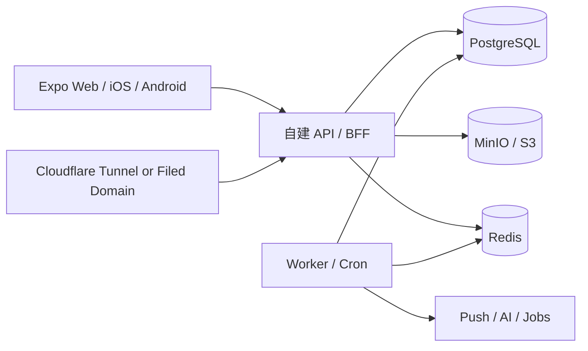

# 自建后端优化路线

此文档是当前自建服务器工作的执行路线。它不替代完整迁移方案；完整背景见 `docs/self-host-migration-plan.md`，Supabase 依赖面见 `docs/self-host-supabase-replacement-map.md`。

## 当前结论

当前最优方案不是把新服务器一次性变成完整生产后端，而是把它作为旁路 staging 后端逐步建设：

1. 生产继续走 Vercel + Supabase。
2. 自建服务器先跑稳定的 staging 基建。
3. 后端通过 API / BFF 逐步接管 Supabase 能力。
4. 前端先增加适配层和 staging 环境，不直接把生产环境变量切到新服务器。
5. 每个业务域验证通过后，再单独确认是否进入生产切换。

## 推荐架构

第一阶段不引入 Keycloak。当前项目优先需要邮箱密码登录、session、重置密码、账号状态和业务鉴权；用 API 内置 Auth 更轻。后续如果需要 SSO、第三方登录或后台管理账号，再引入 Keycloak。

## 入口方案

腾讯云公网入口当前会拦截未备案 staging 域名：

- HTTP 返回 DNSPod webblock。
- HTTPS SNI 表现为 TLS EOF。
- 服务器内部 HTTPS 证书和 Caddy 反代已验证正常。

因此推荐顺序是：

1. Staging 先走 Cloudflare Tunnel，避免被未备案域名拦截。
2. 生产域名如需长期直连腾讯云公网 IP，再做 ICP 备案。
3. 境外入口或 COS / S3 可作为后续扩展，不作为当前第一步。

Cloudflare Tunnel 只需要服务器主动连出，不需要把 PostgreSQL、Redis 或 MinIO 端口暴露公网。推荐 public hostname：

- `api-staging.fanch.tech` -> `http://api:3000`
- `assets-staging.fanch.tech` -> `http://minio:9000`

## 分阶段执行

### Stage 1: 稳定基建

目标：让空服务器成为可重复部署、可恢复、可验证的 staging 环境。

已完成：

- Docker / Compose 安装。
- 腾讯云 Docker registry mirror 配置。
- `/opt/tongpin` staging 栈启动。
- API `/health`、PostgreSQL、Redis 本机健康检查通过。
- Caddy 服务器内部 HTTPS 验证通过。
- PostgreSQL dump 和 MinIO 对象清单备份演练通过。

剩余：

- 绑定 SSH key 后收紧 `22/tcp` 来源。
- 启用 Cloudflare Tunnel 或完成 ICP 备案后重新验证公网 staging。
- 执行服务器重启自恢复验证。
- 建立外部快照或定期备份策略。

### Stage 2: 自建 API 骨架

目标：先建立一个可以替换 Supabase 调用的 API 边界，而不是直接让前端继续直连数据库。

优先实现：

- `GET /health`
- `POST /auth/signup`
- `POST /auth/signin`
- `POST /auth/refresh`
- `POST /auth/signout`
- `GET /me`
- `GET /me/dashboard`

验收：

- 测试账号可登录。
- session refresh 可用。
- API 从 session 解析 `user_id`。
- 前端仍可保留 Supabase 生产路径。

### Stage 3: 核心业务替换

目标：迁移最影响用户体验的核心链路。

推荐顺序：

1. 资料与情侣绑定：profiles、pair_invites、couples、couple_members。
2. 首页 dashboard 只读聚合。
3. 留言发送和通知创建。
4. 信件 / 胶囊信。
5. 今日胶囊。
6. 相册和头像 Storage。

原则：

- 邀请接受、情侣绑定、信件创建/删除、通知创建必须是服务端事务。
- 前端不再拼 `.from(...)` 和 `.rpc(...)`。
- 数据库可以继续保留函数做事务，但调用入口应在 API 层。

### Stage 4: 后台能力替换

目标：替换 Supabase Edge Functions、Realtime、Cron 和 Push worker。

内容：

- WebSocket / SSE 事件层。
- Redis 队列。
- 推送分发 worker。
- 云宠 AI worker。
- 低敏上下文和 service-role 级别内部接口。

### Stage 5: 数据迁移演练

目标：先迁移测试数据，再决定是否迁生产数据。

要求：

- 保持用户 UUID，减少外键重写。
- 密码不直接迁移，旧用户通过重置密码进入新 Auth。
- Storage 只迁 path 和对象，不迁 signed URL。
- 每次演练都有回滚路径。

### Stage 6: 生产切换

生产切换必须单独确认，不和 staging 建设混在一起。

切换前必须满足：

- 自建 API 全量核心路径通过测试。
- 真实数据迁移演练通过。
- 备份、恢复、重启自恢复验证通过。
- 监控和日志可查。
- 前端有可回滚环境变量。
- Supabase 保持只读观察期，不立即关闭。

## 当前下一步

推荐我继续做这几件事：

1. 如果你能提供 Cloudflare Tunnel token，启动 `cloudflared` profile，并重新验证 `api-staging.fanch.tech`。
2. Cloudflare Tunnel 跑通后，执行服务器重启自恢复验证。
3. 绑定 SSH key 后收紧腾讯云轻量防火墙的 `22/tcp` 来源。
4. 确认快照或外部备份策略。
5. 开始实现 Stage 2 的自建 API 骨架。

已完成的运维收尾：

- OrcaTerm 已进入托管会话。
- `/opt/tongpin` 容器状态已复查，API / PostgreSQL / Redis 为 healthy。
- 服务器上的 MinIO 备份脚本已改为不依赖容器内 `find`。
- 备份演练留下的 0 字节文件已清理。

不建议现在做：

- 不切生产域名。
- 不改 Vercel 生产环境变量。
- 不关闭 Supabase。
- 不把 PostgreSQL、Redis、MinIO Console 暴露公网。
- 不把任何 secret 写进仓库或聊天。
