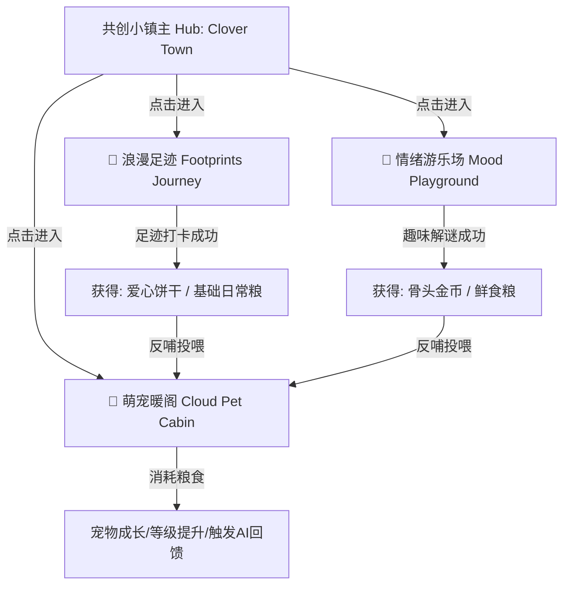

# 共创空间（云宠群岛）UI/UX 视觉美化与“反哺生态”重塑方案

本方案旨在重构共创空间（`CreationSpacePage`）的排版与呈现方式：**将“云宠、足迹、游戏”三大模块在视觉与空间上进行物理分离，同时通过“足迹打卡”与“游戏解谜”产出奖励，构建出完美的“反哺云宠”生态闭环**。

方案坚持“情绪胶囊风”的奶油色系与毛玻璃质感，打造出极具温度和游戏感的情侣共创空间。

---

## 1. 空间架构：从“平铺表单”升级为“共创三叶草群岛” (Three Pillars Hub)

整个共创空间页面重构为 **1 个小镇导航 Hub + 3 个独立沉浸子页面**。三个核心模块互不干扰，但通过“共享资源”实现逻辑上的生态互通：

### 🌸 核心空间一：小镇导航主 Hub (The Clover Town Hub)
* **视觉呈现**：进入共创空间时，呈现在眼前的是一个干净、治愈、无干扰的“共创群岛”俯视图。背景是随着真实时间微弱渐变的粉白奶油色天幕。
* **三个精致的“浮岛卡片”以黄金比例排布**：
  1. **👑 萌宠暖阁 (Cloud Pet Cabin)**：位于上方，展现云宠的实时 Live 状态（如正在睡觉、散步）、等级和一句可爱的 AI 气泡动态。
  2. **🧭 浪漫足迹 (Footprints Journey)**：位于左下方，展现一张微缩的复古手绘指南针图标，以及“已携手走过 X 个地方”的文艺里程碑。
  3. **🧩 情绪游乐场 (Mood Playground)**：位于右下方，展现一个插着小风车的游乐场手绘卡片，以及“今日有新谜题待解开”的小红点提示。
* **物理隔离**：点击任意卡片，以优雅的“缩放淡入”转场，物理上进入完全独立的沉浸式子模块页面，彻底告别原版的杂乱堆叠。

---

## 2. 独立子模块的视觉重塑与“反哺联动”机制

### 👑 模块 A：萌宠暖阁 (Cloud Pet Cabin) —— 治愈相伴，有爱投喂
萌宠暖阁是一个**纯粹、安静的宠物互动天地**。这里去除了所有地图、答题、装扮等繁琐表单，只有你、TA 和你们的云宠。

#### 🎨 视觉美化：
* **糖果情绪状态舱**：饱腹度、洁净度、亲密度升级为圆滚滚的“胶囊进度舱”（使用奶黄 `#FDF3D6`、马卡龙蓝 `#E3EEF4`、蔷薇粉 `#FDEBF1` 填充，并带有微弱的发光效果）。
* **Live 宠物与 AI 说话气泡**：宠物嘴边的气泡升级为高透毛玻璃，并在垂直方向有 `±3px` 的极慢速微呼吸飘浮动效。
* **共享背包（粮仓）**：在舞台右下角设计一个可爱的“共享小粮仓”拟物图标，点击会弹出精美的毛玻璃小抽屉，里面整齐摆放着：
  * **日常粮**（日常足迹打卡产出）
  * **鲜食粮**（趣味解谜/商店购买产出）
  * **骨头金币/奖励点数**（打卡与解谜共同积累）

#### 🔄 反哺互动（投喂仪式）：
* **拟物投喂**：点击粮仓中的“日常粮”或“鲜食粮”，会触发一个“丢掷糖果”的抛物线动效，食物落入宠物的饭碗中，云宠播放“吃东西”动作帧，并冒出红心。
* **成长与回馈**：消耗粮食使云宠成长。每次升级时，云宠会通过 AI 脑发出专属的“感恩信件/日记”，保存在小屋日志中。

---

### 🧭 模块 B：浪漫足迹 (Footprints Journey) —— 浪漫打卡，化为养分
这是一个**充满情调的回忆手账本**。你们曾经携手走过的地方，不只是冰冷的坐标，更是滋养云宠的“养分”。

#### 🎨 视觉美化：
* **折叠与极简表单**：默认只有一张淡粉色的“拍立得式回忆轴”，记录着你们去过的“晚风桥边”、“雨后咖啡馆”。
* **记录新足迹**：点击下方蔷薇粉色描边的胶囊按钮 `[ + 记录新的足迹 ]`，才会以手风琴展开的形式露出输入框（带有粉色 Focus 发光的温润圆角框），不占空间。

#### 🔄 反哺互动（足迹打卡反哺）：
* **「足迹宝箱 / 爱的养分」**：
  * 每次成功记录一个新足迹或在某地打卡，界面会绽放出“胶囊宝箱/许愿瓶”开启的精致动效。
  * **反哺奖励**：弹出提示：“你们一起走过的地方，化作了滋养小家的养分！获得：**日常粮 +1 份**，**骨头金币 +10 点**！”
  * 飞入动效：金币和粮食化作小图标，轻盈地飞向页面右上角的共享资产栏。

---

### 🧩 模块 C：情绪游乐场 (Mood Playground) —— 智力解谜，赚取口粮
这是一个**情侣互动解谜中心**。通过两人的默契答题与趣味谜题，为云宠“赚取豪华加餐”。

#### 🎨 视觉美化：
* **情绪糖果纸答题卡**：谜题卡片做成一张精致的“折角情书便签纸”或者“复古信封”，选项是圆润可爱的马卡龙色胶囊块。
* **换一题与挑战**：页面只留下一道最精致的谜题，右上角带有“今日挑战”和“难度星级”，视觉上像个精致的卡牌小游戏。

#### 🔄 反哺互动（解谜赚粮反哺）：
* **「解谜赏金 / 口粮捕获」**：
  * 当情侣答对题目时，信封中会飞出大量的金色爱心与小骨头粒子，伴随欢快的触觉反馈音效。
  * **反哺奖励**：弹出提示：“答对啦！恭喜获得：**鲜食粮 +1 份**（或**骨头金币 +15 点**）！已存入你们的共享小粮仓，快去投喂 [云宠名字] 吧！”

---

## 3. 共享资源与“反哺”逻辑设计

模块物理分离后，数据层完全共用原本的数据库 `creation_spaces` 表与 RPC。我们无需新增表结构，仅需在**呈现逻辑与提示文案**上做如下视觉转换：

| 数据库原字段/操作 | 原版 UI 呈现 (生硬) | 升级版 UI 呈现 (好玩、有爱) | 反哺逻辑内涵 |
| :--- | :--- | :--- | :--- |
| `basic_food_count` | 简单的数字展示 | **日常粮**（足迹打卡的主要产出） | 走得越远，云宠的日常温饱越有保障 |
| `premium_food_count` | 简单的数字展示 | **鲜食粮**（解谜游乐场的主产出） | 动脑越多，云宠越能吃到豪华加餐 |
| `treat_balance` | 骨头/奖励余额 | **骨头金币**（小镇通用代币） | 用于在暖阁的小铺里补充粮食 |
| `claim_creation_game_reward` | 答对题目后加分 | **解谜通关，赏金入仓** | 智力反哺成长 |
| `couple_footprints.insert` | 保存足迹数据 | **点亮足迹，凝聚养分** | 情感足迹化为云宠饱腹度 |

---

## 4. 排版对比与视觉优势

| 模块区域 | 优化前 (现状) | 优化后 (群岛方案) | 视觉心理效果 |
| :--- | :--- | :--- | :--- |
| **空间感** | 单页超长堆叠，像在填问卷 | 错落有致的三叶草浮岛，物理隔离 | 仪式感极强，具有“家园小镇”的沉浸感 |
| **宠物暖阁** | 杂乱地被包围在设置、表单中 | 纯净的宠物舞台，可拖拽投喂的粮仓背包 | 增强了云宠的生命感和陪伴温度 |
| **足迹记录** | 巨大的经纬度表单长年暴露在外 | 默认折叠，打卡成功后触发“许愿瓶飞出”动效 | 记录足迹变成了一种“收集回忆与口粮”的乐趣 |
| **解谜游戏** | 平铺在底部的答题模块 | “情绪游乐场”卡牌包，答对后粒子飞入粮仓 | 答题动力倍增，形成“为了宠物而战”的动力 |

---

## 5. 后续视觉微动效技术构想 (Animation Hooks)

在前端进行排版展现重构时，仅需使用标准 React Native `Animated` 进行位置和缩放控制即可实现上述转场：
* **浮岛呼吸悬浮动效**：使用 `Animated.loop` 对小镇 Hub 的三个卡片施加不同相位的极慢垂直悬浮位移（`translateY` 在 `0` 到 `4` 之间），让整个群岛显得鲜活灵动。
* **反哺飞入特效**：当在足迹或答题页点击“领取”时，利用一个临时的 `Animated.ValueXY` 渲染一个小金币/小粮食图标，通过贝塞尔曲线飞向页面顶部的资产区，带来即时的视觉满足感。
